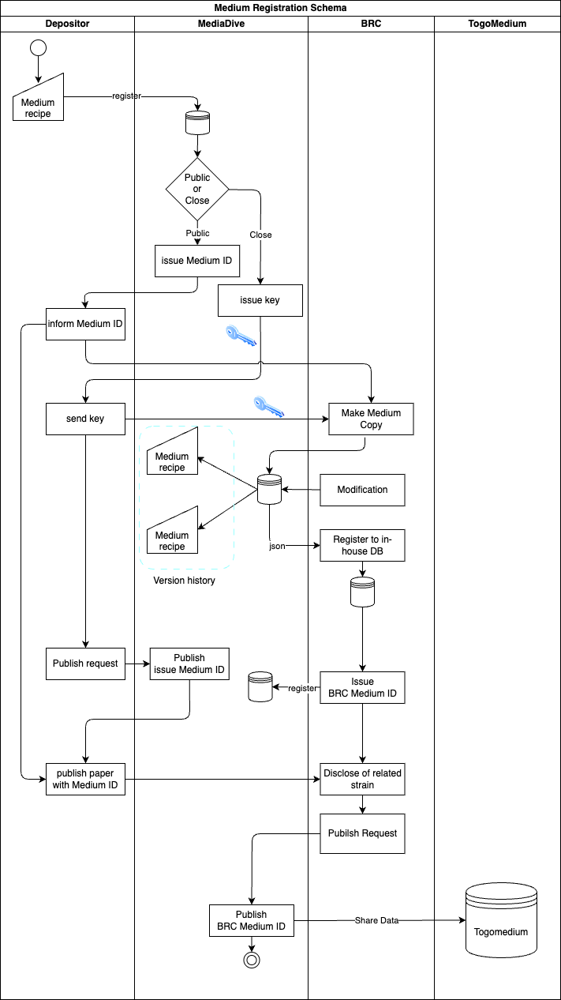

# Introduction

In the field of microbiology, the availability of well-structured data on cultivation media and growth conditions is critical for advancing AI-based predictions of optimal cultivation parameters. However, existing databases often operate in silos, limiting the potential for data integration and cross-platform collaboration. This study aims to bridge this gap by aligning and sharing media information between two prominent platforms: Media*Dive*, operated by DSMZ ([https://mediadive.dsmz.de](https://mediadive.dsmz.de/), [@citesAsDataSource:Koblitz2023]) and TogoMedium operated by DBCLS ([https://togomedium.org](https://togomedium.org/)). By increasing the visibility and standardization of media data across these platforms, we seek to enhance the accessibility of standardized cultivation data. Additionally, we focus on integrating data from BacDive into a comprehensive knowledge graph, encompassing essential growth-related parameters such as oxygen tolerance, pH, temperature, and media composition. This integration not only standardizes the data but also facilitates seamless incorporation into broader knowledge networks, as provided by TogoMedium. Looking ahead, we propose a future initiative that empowers the knowledge bases through depositor-added medium registration, ensuring continued growth and relevance of these crucial resources.

# Results & Discussion

## Bridging the gap between the two cultivation media resources

### Alignment of Ingredient Terminologies

A critical step in integrating data between Media*Dive* and TogoMedium involved aligning the terminologies of cultivation media ingredients. Given the discrepancies in how ingredients were named and categorized across the two platforms, this process required meticulous standardization efforts. For example, the ingredient "glucose" with the ID GMO_001815 in TogoMedium ([https://togomedium.org/component/GMO_001815](https://togomedium.org/component/GMO_001815)) was successfully linked to the corresponding entry in MediaDive ([https://mediadive.dsmz.de/ingredients/5](https://mediadive.dsmz.de/ingredients/5)), despite initial differences in nomenclature and classification. These efforts resulted in 870 established links from Media*Dive* to TogoMedium and in turn 604 links from TogoMedium to Media*Dive*, significantly improving cross-database connectivity.

The process of mapping and linking ingredients between the two platforms revealed challenges related to different terms, standardization practices, and cardinality mismatches. For instance, a single ingredient in one database might correspond to multiple entries in the other, complicating direct one-to-one mappings. Despite these difficulties, the alignment process has enabled the successful linking of ingredients across the platforms, laying the groundwork for more comprehensive data integration.

Table 1: Mapping results of medium ingredients between MediaDive and GMO.

| Mapping Pattern      | No of cases |
| -------------------- | ----------- |
| 1 Media*Dive* to 1 GMO | 482         |
| 1 Media*Dive* to N GMO | 59          |
| N Media*Dive* to 1 GMO | 175         |
| 1 Media*Dive* to 0 GMO | 747         |
| 0 Media*Dive* to 1 GMO | 425         |

### Data Preparation for Media Similarity Calculations

In preparation for integrating cultivation media from one database into the other, we prepared the necessary data to calculate media similarity. This involved normalizing ingredient data and ensuring consistency across datasets, enabling accurate comparisons of media compositions, as well as the definition of formulas and algorithms to successfully calculate concentrations and similarities. The goal of these calculations is to facilitate the seamless integration of media from MediaDive into TogoMedium and vice versa, enhancing the utility and reach of both databases. This calculation also helps in finding alternatives (cheaper or safer) for the ingredients of the medium. We also believe that it is possible to further improve the accuracy of calculating medium similarity. Each component in the medium, such as carbon sources, nitrogen sources, phosphorus sources, and sulfur sources, is added for specific reasons related to cell composition or electron acceptors and donors. For instance, sulfate-reducing bacteria, a group of bacteria that reduce sulfate, include strains that cannot utilize nitrate. Although both sulfate and nitrate are expected to function as electron acceptors, these strains do not grow in the presence of nitrate. TogoMedium assigns 'Role' information to registered compounds, enabling similarity comparisons by weighting each role accordingly.

### Expansion of the Growth Media Ontology (GMO)

To support the broader integration efforts, we expanded the Growth Media Ontology (GMO) [[https://bioportal.bioontology.org/ontologies/GMO](https://bioportal.bioontology.org/ontologies/GMO)] by adding new terms and linking them to Media*Dive* ingredients. This expansion not only enriches the GMO but also strengthens the connections between the ontology and practical, real-world data from cultivation media databases. The addition of these new terms ensures that the ontology remains relevant and comprehensive, supporting future research and data integration initiatives.

## Development of the BacDive RDF Knowledge Graph

Microbial phenotype data is largely available in the Bac*Dive* knowledge base on microbial strains ([https://bacdive.dsmz.de](https://bacdive.dsmz.de), [@citesAsDataSource:Reimer2022])
We have developed the first version of the Bac*Dive* RDF knowledge graph, which is designed to enhance data integration and interoperability within the microbial research community. This knowledge graph represents a significant step forward in standardizing and linking diverse datasets, thereby facilitating future research and application development.

The knowledge graph includes detailed mapping rules for 24 of the most critical entities within Bac*Dive*, ensuring that the most relevant data is accurately represented and connected. These entities include: Strain, Reference, Motility, GramStrain, CellSize, CellShape, CultureMedium, CultureTemp, CulturePH, OxygenTolerance, LocationOfOrigin, IsolationSource, EnrichmentProcedure, ColonyMorphology, Halophily, SporeFormation, RiskAssessment, Enzyme, Pigmentation, Sequence16S, SequenceGenome, StrainSynonym, NutritionType, and GCContent. In total, the graph contains more than 2.6 Mio triples. By focusing on these entities, we have laid a robust foundation for the comprehensive integration of Bac*Dive* data into broader knowledge frameworks, which can be further expanded in the future.

The Bac*Dive* knowledge graph has been materialized in the turtle format, a standard RDF serialization that is widely used for data sharing and integration in the Semantic Web community. This materialization ensures that the data is accessible and easily integrated with other RDF-based resources, promoting interoperability and reuse. However, deployment of the BacDive RDF knowledge graph is currently ongoing as it involves further testing and refinement to ensure that the knowledge graph functions as intended within various data environments. Once deployed, this knowledge graph will serve as a critical resource for researchers seeking to integrate BacDive data with other microbial and biological datasets. The mapping files and instructions can be found at [https://github.com/JKoblitz/bacdive-rdf](https://github.com/JKoblitz/bacdive-rdf).

## A proposal for a depositor-provided medium registration process

We have designed a streamlined process for depositors — researchers who isolate strains and wish to deposit them at a Biological Resource Center (BRC) — to ensure that media recipes are entered, managed, and cited in a standardized manner. This will ensure both, the better reproducibility of cultivation media preparation and a larger availability of cultivation data in the future. This process is depicted in Figure 1 and consists of the following key steps:

### Step 1: Standardized Media Recipe Submission

Depositors begin by registering their media recipes in Media*Dive* using the medium builder tool. This tool allows them to enter detailed information about the media composition in a standardized format, ensuring that the data is consistent and easily shareable. Additionally, the final composition of the medium will be automatically calculated and more metadata can be added. This includes a list of primary authors of the medium, associated strains and final pH and gas compositions.

### Step 2: Public or Closed Access Decision

Once the recipe is submitted, Media*Dive* curators review the entry. The depositor can decide whether to make the media recipe public immediately or keep it closed for now. If made public, Media*Dive* issues a unique and persistent Medium ID that serves as a reference for the media recipe. It can be used immediately to refer to the medium in publications and to share the recipe with collaborators and the BRC the strain will be submitted to. In case of closed access, a unique keyphrase is issued, which can be used for further editing of the medium as well as communication to the BRCs.

### Step 3: BRC Medium ID Registration

The BRC registers the media recipe into their in-house database, potentially after making any necessary modifications. These modifications will also be represented in Media*Dive* while still linking to the original recipe of the depositor. Once the BRC issues its own unique BRC Medium ID, the new (potentially modified) recipe will receive this unique ID. This ensures that any strain deposited at the BRC is associated with a well-documented and standardized media recipe, enhancing reproducibility and transparency in microbial research. Furthermore, creating a copy of the medium ensures that each party–the BRC and the depositor–may edit their version of the recipe without interfering with the others.

### Step 4: Publishing the Medium

The medium registered by the BRC will be published once the original author agrees to it. Additionally, the strain information, such as growth temperature, growth time and culture collection numbers will be added to the medium. This might happen together with the StrainRegistry efforts currently targeted by the StrainInfo service.

### Step 5: Sharing information between Media*Dive* and TogoMedium

Lastly, once a new cultivation medium is registered, the data will be shared between Media*Dive* and TogoMedium. To ensure this, the possibility to register new medium compounds into the two databases have to be integrated. Furthermore, an exchange format has to be developed as well as a secure push mechanism to ensure seamless integration of the data.

Overall, this process not only facilitates the standardized recording and sharing of media recipes but also strengthens the integration between media databases and biological resource centers, promoting consistency and reproducibility in microbiological research.

# Conclusions

This study has made significant efforts in enhancing the integration and standardization of cultivation media data, paving the way for more robust AI-based predictions and broader data interoperability. By aligning terminologies and mapping ingredients between Media*Dive* and TogoMedium, expanding the Growth Media Ontology, and developing a comprehensive Bac*Dive* RDF knowledge graph, we have established a strong foundation for future microbial research. Additionally, the proposed medium registration process ensures that media recipes are consistently recorded, better standardized and easily cited, further promoting transparency and reproducibility in the field. These efforts collectively contribute to the advancement of microbial data science and set the stage for continued innovation and collaboration.
